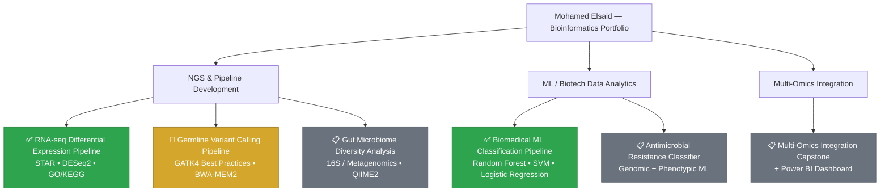

# Mohamed Elsaid

**Bioinformatics & Biotech Data Analytics | NGS Pipeline Development | GMP/GLP Data Integrity**

M.S. Bioinformatics Candidate | Johns Hopkins University (Expected 2026)
Maryland, USA

Email: [melsaid2017@gmail.com](mailto:melsaid2017@gmail.com) • Portfolio: [mohamedelsaid-bit.github.io/Portfolio-](https://mohamedelsaid-bit.github.io/Portfolio-/) • LinkedIn: [linkedin.com/in/mohamed-elsaid-0a0b56231](https://www.linkedin.com/in/mohamed-elsaid-0a0b56231/) • GitHub: [github.com/MohamedElsaid-bit](https://github.com/MohamedElsaid-bit) • Resume: [Mohamed_Elsaid_Resume.pdf](https://github.com/MohamedElsaid-bit/Portfolio-/blob/main/Mohamed_Elsaid_Resume.pdf)

---

## About Me

I bring 3+ years of GMP/GLP laboratory experience from **Pfizer** and **Catalent Pharma Solutions** — including SARS-CoV-2 vaccine immunogenicity testing and sterility/bioburden QC supporting FDA submissions — into computational biology. That background means I build NGS pipelines and analytics tools the way regulated biotech expects: version-controlled, reproducible, validated, and documented end-to-end (ALCOA+ principles applied to code, not just paper records).

I'm completing my M.S. in Bioinformatics at Johns Hopkins, focused on NGS data analysis, variant calling, and translating raw sequencing/experimental data into decision-ready results for drug development and diagnostics.

**What I'm looking for:** Entry-level Bioinformatics Analyst/Scientist, Computational Biologist, or Biotech Data Analyst roles where NGS pipeline development, statistical rigor, and data integrity intersect.

---

## Project Map

**Legend:** 🟢 Completed &nbsp;|&nbsp; 🟡 In Progress &nbsp;|&nbsp; ⚪ Planned

---

## Completed Projects

### [RNA-seq Differential Expression Pipeline](https://github.com/MohamedElsaid-bit/rna-seq-differential-expression-pipeline)
End-to-end NGS workflow: raw read QC (FastQC), adapter/quality trimming (Trimmomatic), splice-aware alignment (STAR), gene-level quantification (featureCounts), and differential expression testing (DESeq2), with downstream GO/KEGG pathway enrichment across 3 replicate sets.
**Stack:** Python, R/DESeq2, STAR, FastQC, Trimmomatic, GO/KEGG

### [Biomedical ML Classification Pipeline](https://github.com/MohamedElsaid-bit/biomedical-ml-classification)
Benchmarked Random Forest, Logistic Regression, and SVM classifiers on a biological dataset with 5-fold cross-validation and feature engineering. Reports ROC/AUC, confusion matrices, and feature importance for model interpretability.
**Stack:** Python, scikit-learn

---

## Roadmap (In Progress / Planned)

| Project | Description | Stack | Status |
|---|---|---|---|
| **Germline Variant Calling Pipeline** | GATK4 Best Practices workflow (FastQC → Trimmomatic → BWA-MEM2 → MarkDuplicates → BQSR → HaplotypeCaller → filtering → SnpEff annotation) on a chr20/NA12878 benchmark subset. | Snakemake, GATK4, BWA-MEM2, SnpEff | 🚧 In Progress |
| **ML Drug / Antimicrobial Resistance Classifier** | Classifier predicting antimicrobial resistance from genomic and phenotypic data — direct application to biotech drug-resistance screening. | Python, scikit-learn | 📋 Planned |
| **Human Gut Microbiome Diversity Analysis** | Diversity/composition analysis from 16S rRNA and metagenomic sequencing data. | Python, R, QIIME2 | 📋 Planned |
| **Multi-omics Integration Capstone** | Capstone integrating transcriptomic, genomic, and/or other omics layers into a unified analysis, with an interactive Power BI dashboard for results exploration. | Python, R, Power BI | 📋 Planned |

---

## Technical Skills

- **NGS & Pipelines:** RNA-seq, germline variant calling, sequence alignment (STAR, BWA-MEM2), read QC/trimming (FastQC, Trimmomatic), GATK4 Best Practices, SAMtools, SnpEff annotation, GO/KEGG enrichment, Snakemake workflow management
- **Statistical & ML Analysis:** R/DESeq2 differential expression, scikit-learn (Random Forest, Logistic Regression, SVM), k-fold cross-validation, ROC/AUC, feature engineering, feature importance
- **Languages & Tools:** Python, R, SQL, Bash, Linux/Unix, Git/GitHub, Conda, Docker, GitHub Actions CI
- **Data Integrity & GMP/GLP:** LIMS, ALCOA+, 21 CFR Part 11, SOP development, audit-ready documentation, regulated laboratory data workflows

---

## Professional Background

3+ years as an Associate Scientist at **Pfizer** (SARS-CoV-2 vaccine immunogenicity testing, statistical analysis supporting FDA submissions) and **Catalent Pharma Solutions** (GMP sterility/bioburden testing, zero data-integrity findings over a 6-month audit period). This regulated-industry background is what I bring to every pipeline I build — reproducibility and data integrity aren't an afterthought, they're the starting point.

Full details in my [resume](https://github.com/MohamedElsaid-bit/Portfolio-/blob/main/Mohamed_Elsaid_Resume.pdf).

---

## Contact

Open to entry-level roles in **bioinformatics, biotech data analytics, computational biology, and NGS pipeline development**, particularly where data integrity and scientific rigor are valued.

Email: [melsaid2017@gmail.com](mailto:melsaid2017@gmail.com) • LinkedIn: [linkedin.com/in/mohamed-elsaid-0a0b56231](https://www.linkedin.com/in/mohamed-elsaid-0a0b56231/) • GitHub: [github.com/MohamedElsaid-bit](https://github.com/MohamedElsaid-bit)

---

© 2026 Mohamed Elsaid
