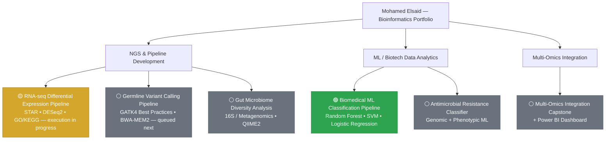

# Mohamed Elsaid

**Bioinformatics & Biotech Data Analytics | NGS Pipeline Development | GMP/GLP Data Integrity**

M.S. Bioinformatics, Johns Hopkins University (2026) · Maryland, USA

📧 [melsaid2017@gmail.com](mailto:melsaid2017@gmail.com) &nbsp;·&nbsp; 🌐 [Portfolio](https://mohamedelsaid-bit.github.io/Portfolio-/) &nbsp;·&nbsp; 💼 [LinkedIn](https://www.linkedin.com/in/mohamed-elsaid-0a0b56231/) &nbsp;·&nbsp; 🐙 [GitHub](https://github.com/MohamedElsaid-bit) &nbsp;·&nbsp; 📄 [Resume](https://github.com/MohamedElsaid-bit/Portfolio-/blob/main/Mohamed_Elsaid_Resume.pdf)

---

### Contents
[About](#about-me) · [Project Map](#project-map) · [Completed Projects](#completed-projects) · [Roadmap](#roadmap-in-progress--planned) · [Technical Skills](#technical-skills) · [Professional Background](#professional-background) · [Contact](#contact)

---

## About Me

Pharmaceutical scientist turned bioinformatician. I build NGS pipelines and ML workflows the way regulated biotech expects — version-controlled, reproducible, validated, and documented end-to-end.

- 🎓 **M.S. Bioinformatics**, Johns Hopkins University (2026 graduate)
- 🏢 **3+ years** GMP/GLP industry experience — Pfizer, Catalent Pharma Solutions
- 🧬 **ALCOA+ discipline applied to code** — the same data-integrity standard used for regulatory submissions, now applied to pipelines and repos
- 🎯 **Targeting:** entry-level Bioinformatics Analyst/Scientist, Computational Biologist, or Biotech Data Analyst roles

---

## Project Map

🟢 Completed &nbsp;·&nbsp; 🟡 In Progress &nbsp;·&nbsp; ⚪ Planned

---

## Completed Projects

### [Biomedical ML Classification Pipeline](https://github.com/MohamedElsaid-bit/biomedical-ml-classification)
Benchmarked Random Forest, Logistic Regression, and SVM classifiers on a biological dataset with 5-fold cross-validation and feature engineering. Leakage-aware pipeline design (scaling fit on training folds only), CI-validated on every push.

**Held-out test set results:**

| Model | Accuracy | ROC-AUC |
|---|:---:|:---:|
| Logistic Regression | **98.3%** | **0.995** |
| SVM (RBF) | **98.3%** | **0.995** |
| Random Forest | 95.6% | 0.994 |

*Wisconsin Breast Cancer dataset · academic/portfolio use only, not clinical*

**Stack:** Python · scikit-learn &nbsp;|&nbsp; [View Code →](https://github.com/MohamedElsaid-bit/biomedical-ml-classification)

---

## Roadmap (In Progress / Planned)

| Project | Description | Stack | Status |
|---|---|---|:---:|
| **RNA-seq Differential Expression** | Snakemake workflow built end-to-end (FastQC → Trimmomatic → STAR → featureCounts → DESeq2 → GO/KEGG). Executing against a 4-sample GEO subset to generate and commit real results. | Python, R/DESeq2, STAR, FastQC, GO/KEGG | 🟡 In Progress |
| **Germline Variant Calling** | GATK4 Best Practices (FastQC → Trimmomatic → BWA-MEM2 → MarkDuplicates → BQSR → HaplotypeCaller → filtering → SnpEff) on a chr20/NA12878 benchmark subset. | Snakemake, GATK4, BWA-MEM2, SnpEff | ⚪ Queued next |
| **AMR Classifier** | Predicts antimicrobial resistance from genomic + phenotypic data — direct biotech drug-resistance screening application. | Python, scikit-learn | ⚪ Planned |
| **Gut Microbiome Diversity** | Diversity/composition analysis from 16S rRNA and metagenomic sequencing data. | Python, R, QIIME2 | ⚪ Planned |
| **Multi-Omics Capstone** | Integrates transcriptomic, genomic, and other omics layers, with an interactive Power BI dashboard for results exploration. | Python, R, Power BI | ⚪ Planned |

---

## Technical Skills

| Category | Skills |
|---|---|
| **NGS & Pipelines** | RNA-seq · Germline variant calling · STAR · BWA-MEM2 · FastQC · Trimmomatic · GATK4 Best Practices · SAMtools · SnpEff · GO/KEGG enrichment · Snakemake |
| **Statistical & ML** | R/DESeq2 · scikit-learn (Random Forest, Logistic Regression, SVM) · k-fold CV · ROC/AUC · feature engineering |
| **Languages & Tools** | Python · R · SQL · Bash · Linux/Unix · Git/GitHub · Conda · Docker · GitHub Actions CI |
| **GMP/GLP & Data Integrity** | LIMS · ALCOA+ · 21 CFR Part 11 · SOP development · audit-ready documentation |

---

## Professional Background

3+ years as an Associate Scientist at **Pfizer** (SARS-CoV-2 vaccine immunogenicity testing, statistical analysis supporting FDA submissions) and **Catalent Pharma Solutions** (GMP sterility/bioburden testing, zero data-integrity findings over a 6-month audit period). Reproducibility and data integrity aren't an afterthought in my work — they're the starting point.

Full details in my [resume](https://github.com/MohamedElsaid-bit/Portfolio-/blob/main/Mohamed_Elsaid_Resume.pdf).

---

## Contact

Open to entry-level roles in **bioinformatics, biotech data analytics, computational biology, and NGS pipeline development**, particularly where data integrity and scientific rigor are valued.

📧 [melsaid2017@gmail.com](mailto:melsaid2017@gmail.com) &nbsp;·&nbsp; 💼 [LinkedIn](https://www.linkedin.com/in/mohamed-elsaid-0a0b56231/) &nbsp;·&nbsp; 🐙 [GitHub](https://github.com/MohamedElsaid-bit)

---

© 2026 Mohamed Elsaid
